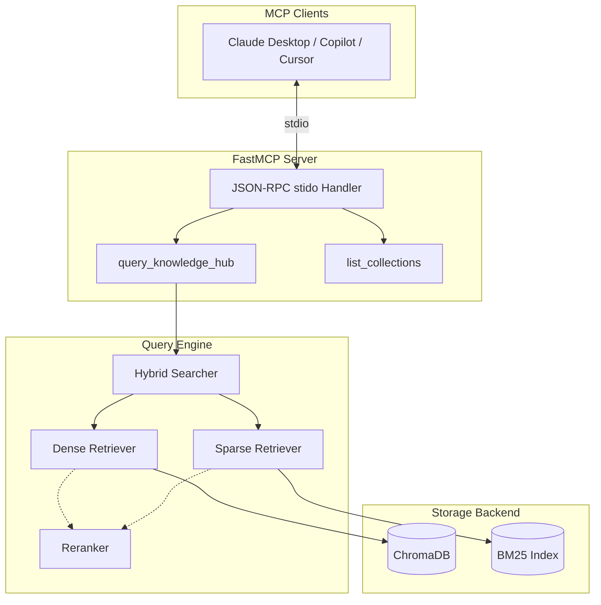
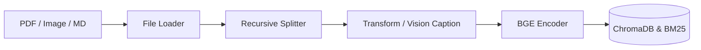

# 🧩 Modular RAG MCP Server

[](https://www.python.org/downloads/)
[](https://modelcontextprotocol.io)
[](https://streamlit.io/)
[](https://www.trychroma.com/)

**Modular RAG MCP Server** 是一个基于 **[Model Context Protocol (MCP)](https://modelcontextprotocol.io)** 构建的生产级、可插拔且具备全链路可观测性的 RAG（检索增强生成）服务框架。

通过本服务，你可以轻松地将庞大的本地私有知识库（如 PDF 文档、图片、Markdown）无缝暴露给 **Claude Desktop**、**GitHub Copilot** 或 **Cursor** 等 AI 助手，使其在不泄露隐私的前提下，基于您的私有数据进行极高精准度的知识问答。

---

## ✨ 核心特性

- **🔌 协议级无缝接入**：基于官方推荐的 `FastMCP` (stdio) 协议实现，零成本直接接入任何支持 MCP 的 AI 助手客户端。
- **⚙️ 极致模块化 (Plug-and-Play)**：
  - 基于工厂模式（Factory Pattern）设计。
  - **LLM**、**Embedding**、**VectorStore** (Chroma)、**Reranker** 等核心组件均支持零代码修改下的热切换。
- **🔍 混合检索 (Hybrid Search)**：结合 `BGE-M3` (Dense 稠密向量) 与 `BM25` (Sparse 稀疏关键词检索)，并通过 RRF (Reciprocal Rank Fusion) 融合。
- **👁️ 多模态支持 (Vision-Language)**：自动识别 PDF 内嵌图片，使用 Vision 模型生成 Caption 后与文本块共同构建语义索引。
- **📊 工业级可观测性**：内置基于 Streamlit 的可视化看板 (Dashboard)，提供数据管理、端到端 Traces（瀑布流耗时分析）及 RAG 效果自动化评估工具。
- **🛡️ 生产级稳定**：完全异步非阻塞的事件循环，解决由于本地加载 `torch` 等重量级 C 扩展包导致的 GIL 死锁痛点。

---

## 🏗️ 系统架构

### 1. 检索与协议层 (Query & MCP Server)


### 2. 摄取流水线 (Ingestion Pipeline)


---

## 🚀 快速开始 (Quickstart)

### 1. 环境准备与依赖安装
本项目推荐使用 `uv` 进行现代化的 Python 依赖管理，极速且避免环境污染。
```bash
# 克隆项目代码后，在项目根目录执行：
uv venv

# 激活虚拟环境 (Windows)
.venv\Scripts\activate

# 激活虚拟环境 (macOS/Linux)
source .venv/bin/activate

# 安装项目包及所有依赖
uv pip install -e .
```

### 2. 初始化配置文件
```bash
# 复制环境变量模板
cp .env.example .env

# 复制全局配置文件模板
cp config/settings.yaml.example config/settings.yaml
```
编辑 `.env` 文件，填入所需的大模型 API Key（本项目默认集成 MIMO 或兼容 OpenAI 的服务）：
```env
MIMO_API_KEY=your_api_key_here
# 如果使用了额外的 Vision 模型：
OPENAI_API_KEY=sk-xxxx
```

### 3. 数据入库 (Ingestion)
将示例的私有文档解析并存入 ChromaDB 向量库：
```bash
python scripts/ingest.py --path data/documents/default/LLM基础知识.pdf --collection default
```
*此时系统会执行：加载文档 -> 递归切片 -> OCR/Captioning -> 向量化 -> 存储。你可以通过日志看到每个阶段的耗时。*

### 4. CLI 检索测试
在接入大模型前，可先通过 CLI 脚本验证混合检索效果：
```bash
python scripts/query.py --query "什么是 RAG 技术？" --verbose
```

---

## 💻 接入 AI 助手 (MCP 客户端配置)

成功运行基础流程后，我们就可以将其接入您的 AI IDE 或桌面对话客户端了！

### GitHub Copilot (VS Code)
编辑 VS Code 的 MCP 配置（路径位于 `%APPDATA%\Code\User\globalStorage\saoudrizwan.claude-dev\settings\cline_mcp_settings.json` 或 VS Code 原生设置面板）：
```json
{
  "mcpServers": {
    "modular-rag": {
      "command": "C:\\你的绝对路径\\.venv\\Scripts\\python.exe",
      "args": ["-m", "src.mcp_server.server"],
      "env": {
        "MIMO_API_KEY": "你的_API_KEY"
      }
    }
  }
}
```

### Cursor IDE
1. 打开 Cursor Settings -> Features -> MCP Servers
2. 点击 "+ Add New MCP Server"
3. Type 选择 `stdio`
4. Name 输入 `modular-rag`
5. Command 输入 `C:\你的绝对路径\.venv\Scripts\python.exe -m src.mcp_server.server`
*(注：如果需要环境变量，可在启动 Cursor 前注入，或者直接硬编码到 `.env`)*

### Claude Desktop
编辑 Claude Desktop 配置文件（Windows: `%APPDATA%\Claude\claude_desktop_config.json`，Mac: `~/Library/Application Support/Claude/claude_desktop_config.json`）：
```json
{
  "mcpServers": {
    "modular-rag": {
      "command": "/absolute/path/to/project/.venv/bin/python",
      "args": ["-m", "src.mcp_server.server"],
      "env": {
        "MIMO_API_KEY": "your_api_key_here"
      }
    }
  }
}
```
**配置完毕后，重启您的 AI 助手，在对话框内即可直接提问：“帮我查阅一下关于 LLM 的本地资料”**。

---

## 🛠️ 配置说明 (`settings.yaml`)

`config/settings.yaml` 决定了整个系统的引擎架构。通过修改此文件，你可以零代码地替换底层模型。

| 模块类别 | 字段 | 说明与可选值 |
|------|------|------|
| `llm` | `provider` / `model` | 控制普通对话及文本分析。支持 `mimo`, `openai`, `ollama`。 |
| `vision_llm` | `provider` / `model` | 用于多模态 PDF 的图片解析。置空则不进行图片识别。 |
| `embedding` | `provider` / `model_path` | 生成密集向量。默认加载 `models/bge-m3` 本地模型以保证性能。 |
| `splitter` | `strategy` / `chunk_size` | 文档切分策略（如 `recursive`）。`chunk_size` 推荐 500-1000。 |
| `retrieval` | `hybrid` / `dense_weight` | `hybrid: true` 开启稠密与稀疏混合检索。`dense_weight` 调节两者分数比重（默认 0.7）。 |
| `vector_store` | `persist_directory` | ChromaDB 数据持久化存放目录（默认 `data/db/chroma`）。 |

---

## 📊 可视化控制台 (Dashboard)

除了核心的协议层，本项目最大的特色在于提供了开箱即用的白盒化观测平台。

**启动 Dashboard**：
```bash
streamlit run src/observability/dashboard/app.py
```

**六大核心面板**：
1. 🏠 **系统总览 (Overview)**：全局指标，包含系统激活的 LLM 种类、向量数据库统计、文档总量等。
2. 📂 **数据浏览器 (Data Browser)**：透视黑盒！你可以查看任何一篇文档被切分成了多少个 Chunk，以及每个 Chunk 里的原文和图片内容是什么。
3. 📥 **Ingestion 管理**：无需敲命令行，直接在界面上传 PDF，点击“开始处理”，即可实时查看文档摄取进度。
4. ⏱️ **Ingestion 追踪**：深入性能调优，提供火焰图/瀑布流，告诉你文档处理慢是卡在了 PDF 解析、OCR 还是 Embedding 计算上。
5. 🔍 **Query 追踪**：详细展示了上一次 MCP 检索时，BM25 找回了什么，BGE 找回了什么，RRF 算法是如何重新打分的。
6. 📈 **评估面板 (Evaluation)**：内置 RAGAs 评测逻辑。加载包含 `<Query, Golden_Docs>` 的测试集文件，自动给出 **Hit Rate** 和 **MRR** 的评分。

---

## 👨‍💻 开发者指南

### 添加一个新的组件 (如新增 Ollama 模型)
本项目完全基于依赖注入设计。如果你想新增一个 LLM Provider，只需：
1. 继承 `BaseLLM` 创建 `OllamaLLM` 类。
2. 在类上方使用装饰器 `@register_llm("ollama")`。
3. 在 `settings.yaml` 中将 `llm.provider` 改为 `ollama`，系统会自动路由加载。

### 测试体系
我们在开发中采用了严格的 TDD / 契约测试驱动，全量覆盖高达 1200+ 断言：
```bash
# 运行单元测试 (核心契约与抽象逻辑校验)
pytest tests/unit/ -v

# 运行集成测试 (向量存储持久化、链路贯通性)
pytest tests/integration/ -v

# 运行 MCP E2E 协议层测试 (模拟客户端 stdio 通信)
pytest tests/e2e/test_mcp_client.py -v

# 运行所有自动化测试
pytest -v
```

---

## ❓ 常见问题排障 (FAQ)

**Q1: 在 Windows 上启动 Server 或执行 MCP 查询时直接卡死，无响应？**  
**A:** 这是 Python 异步框架 `anyio` 的线程池机制与带有复杂 C/C++ 扩展的库（如 `torch`、`FlagEmbedding`）冲突导致了全局 GIL 死锁。
**解决办法**：本项目已在 `src.mcp_server.server` 中主动预导入了这些厚重包。若你后续引入了类似 `onnxruntime` 等包，请务必也在 `server.py` 最顶层先 `import`。

**Q2: Claude 提示 “Initialization Timeout” 或闪退？**  
**A:** MCP 客户端无法正确找到你的 Python 解释器。请不要在 `mcpServers` 的 `command` 中使用 `python`，必须填入 `.venv` 环境下 Python 的**绝对路径**（例如 `C:\\Projects\\rag\\.venv\\Scripts\\python.exe`）。可通过终端单独执行此绝对路径来排除模块丢失问题。

**Q3: 为什么包含图片的 PDF 入库特别慢？**  
**A:** 系统发现图片时，会默认调用 `Vision LLM` 提取图片内容。如果你的模型调用限速或未配置，会卡住。你可以在 `settings.yaml` 的 `pipeline.use_vision_llm` 设置为 `false` 暂时关闭图文功能以获得极致的入库速度。
